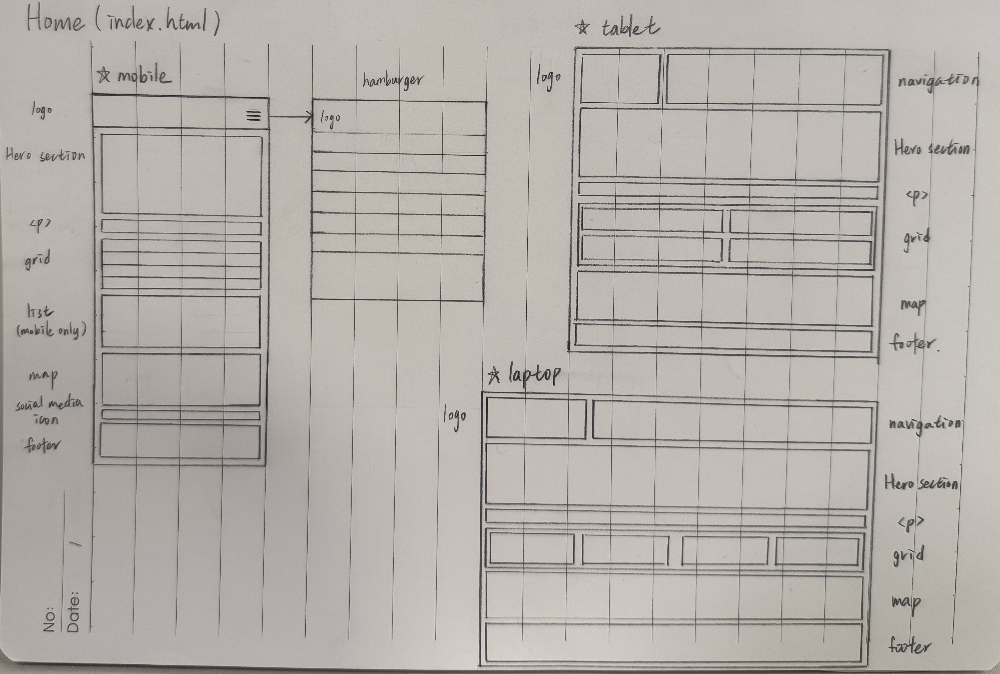
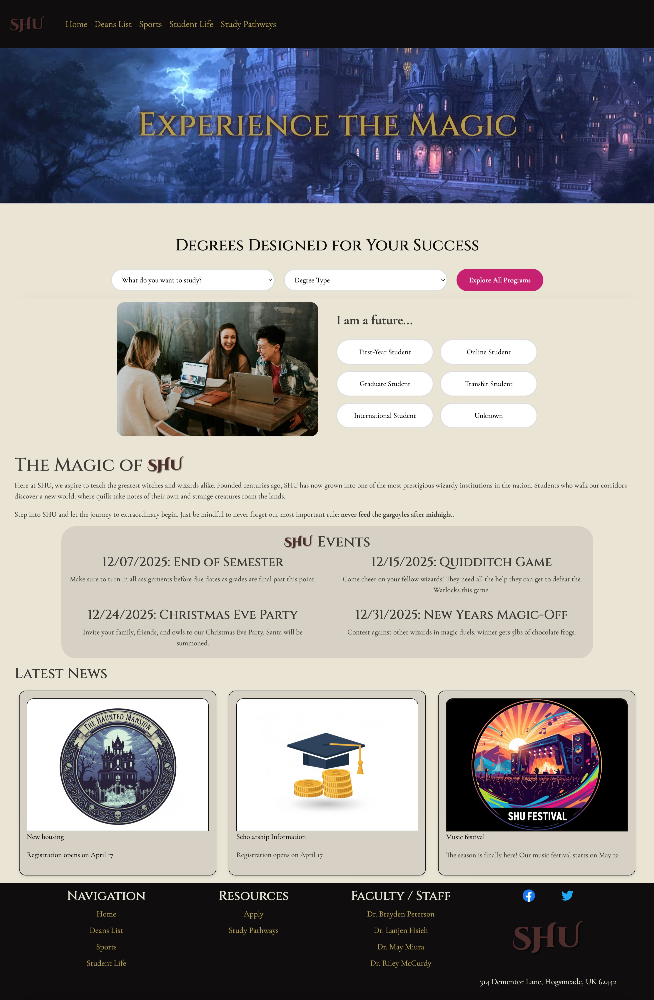
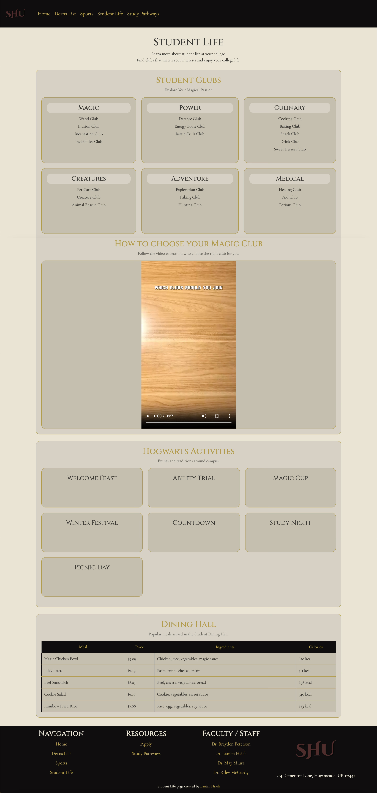
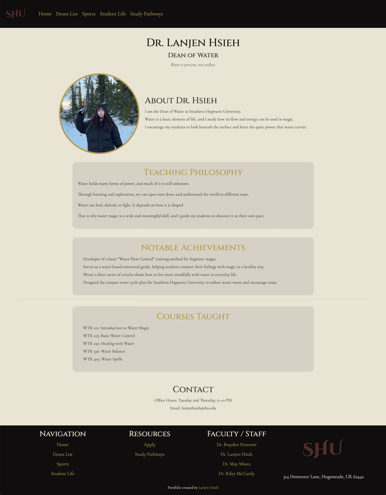

# University Website Project

This is a fictional university website project that I built with my classmates.

The goal of this project was to practice building a **multi-page responsive website** using HTML, CSS, JavaScript, and Bootstrap.

In this project, each student was responsible for different pages of the website.

I mainly worked on the Student Life page, my personal portfolio page, and helped with homepage layout design and styling.

## Live Demo

You can view the website here:
https://marinka0517.github.io/university_website_project/

## Key Features

- Responsive navigation bar using Bootstrap
- Multi-page website structure
- Personal portfolio profile page
- Responsive layout for mobile, tablet, and desktop
- Layout planning using a hand-drawn UI sketch

## My Role in the Project

In this team project, I participated in several parts of the website development.

My main contributions include:
- Designing layout ideas for the homepage  
- Implementing the Student Life page
- Creating my own portfolio page inside the Deans List  
- Adjusting layout, spacing, and visual styling for some sections  

Before starting development, I also sketched the homepage layout to help organize the structure of the website.

This helped the team decide where to place the navigation, sections, and content blocks.

## Homepage Layout Sketch

Before building the homepage, I first sketched the layout structure on paper.

This helped me plan how the website should look on different screen sizes, including:
- Mobile  
- Tablet  
- Laptop  

I used this sketch to organize the page structure, including:
- navigation bar  
- hero section  
- content grid  
- map section  
- footer

This planning step helped me decide how to structure the HTML layout and how to apply responsive design using Bootstrap.

## Pages I Worked On

### Home Page (Team Collaboration)

For the homepage, I helped organize the visual layout and page structure.

What I contributed:
- helped decide the page layout structure
- worked on content placement and spacing
- adjusted some visual styling and alignment

Technical implementation:
- Bootstrap responsive navigation bar
- CSS for layout spacing and styling
- Google Fonts for visual design

The navigation bar collapses into a hamburger menu on smaller screens, which improves usability on mobile devices.

### Student Life Page (Main Responsibility)

This page introduces campus activities and student experiences.

What I implemented:
- structured content sections using HTML
- layout styling using CSS
- organized images and text to create a clean layout

Technical skills used:
- HTML page structure  
- CSS layout styling  
- Bootstrap responsive layout

The goal of this page was to make the information easy to read and visually organized.

### Personal Portfolio Page

Inside the Deans List page, each student created a personal portfolio page.

My portfolio page introduces a fictional character: Dr. Lanjen Hsieh — Dean of Water

In this page I implemented:
- profile layout with image and description  
- multiple sections for content organization  
- structured page layout using semantic HTML

Page sections include:
- About  
- Teaching Philosophy  
- Notable Achievements  
- Courses Taught  
- Contact Information

This page helped me practice building a profile-style web page layout.

## Skills Practiced in This Project

Through this project, I practiced the following skills:
- HTML page structure  
- CSS layout design  
- Bootstrap responsive design  
- Navigation bar implementation  
- Multi-page website structure  
- Basic UI layout planning

## Technologies Used

- HTML  
- CSS  
- JavaScript  
- Bootstrap

## Project Structure

index.html — Home page  
deans.html — Deans list page  
student_life.html — Student life page  
sports.html — Sports page  
areas_of_study.html — Study pathways page  
styles.css — main styling  
javascript.js — JavaScript functionality

## What I Learned

From this project I learned how to:
- organize a multi-page website  
- work with teammates on web development  
- design page layouts before coding  
- use Bootstrap to create responsive web pages

This project helped me understand how front-end web development works in a team environment.
